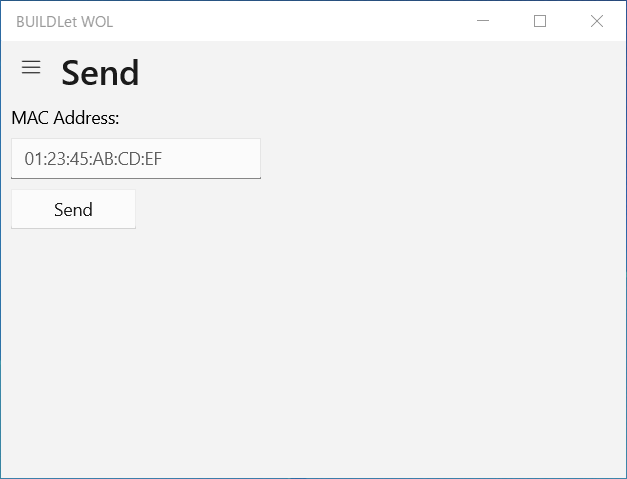
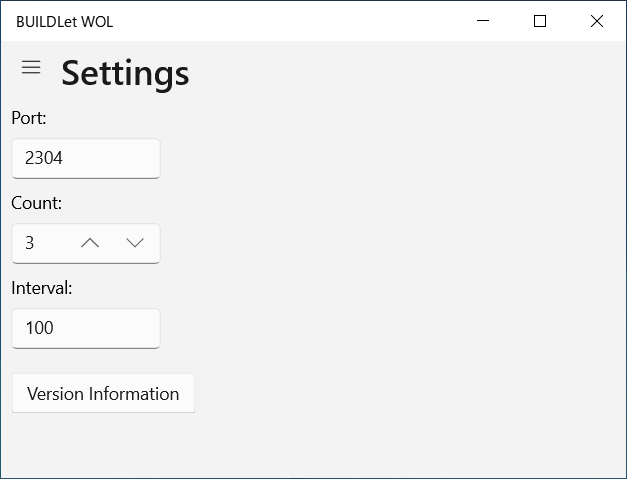
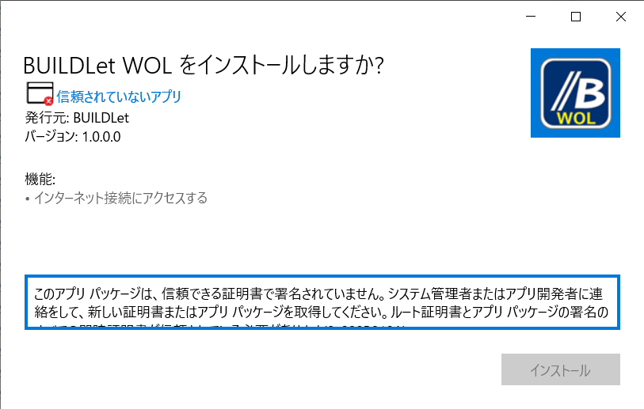
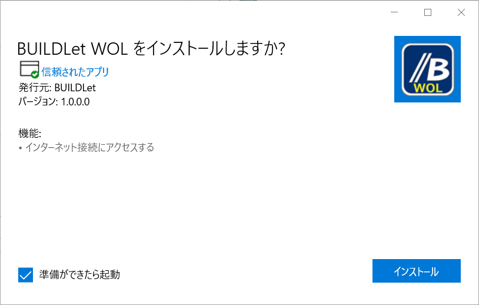

BUILDLet WOL
============

Introduction
------------

This project provides AMD Magic Packet Format Transmitter App on UWP (Universal Windows Platform).

- Send Page  

  

- Setting Page

  

Getting Started
---------------

1. Download the certification file [BUILDLet.cer](./Certificate/BUILDLet.cer) to your computer.
2. Import the downloaded certification file (BUILDLet.cer) into "Trusted Root Certification Authorities" of Local Machine, if you can trust us.
3. Download the installer package for your platform ([x86](./BUILDLet.WOL/AppPackages/BUILDLet.WOL_1.0.0.0_x86_Test/BUILDLet.WOL_1.0.0.0_x86.msix), [x64](./BUILDLet.WOL/AppPackages/BUILDLet.WOL_1.0.0.0_x64_Test/BUILDLet.WOL_1.0.0.0_x64.msix), [ARM](./BUILDLet.WOL/AppPackages/BUILDLet.WOL_1.0.0.0_ARM_Test/BUILDLet.WOL_1.0.0.0_ARM.msix) or [ARM64](./BUILDLet.WOL/AppPackages/BUILDLet.WOL_1.0.0.0_ARM64_Test/BUILDLet.WOL_1.0.0.0_ARM64.msix)) on your computer, and execute it.

Trouble Shooting
----------------

- If you have not correctly imported our certification file ([BUILDLet.cer](./Certificate/BUILDLet.cer)) into "Trusted Root Certification Authorities" of Local Machine, "Install" button is not enabled as the following figure.

  

  If you can successfully import our certification file ([BUILDLet.cer](Certificate/BUILDLet.cer)), "Install" button gets enabled as the following figure.

  

Build and Test
--------------

- This project (Visual Studio Solution) is built and tested on Visual Studio.
- We did not tested our App on ARM Platform (including ARM64).

License
-------

This project is licensed under the [MIT](https://opensource.org/licenses/MIT) License.
