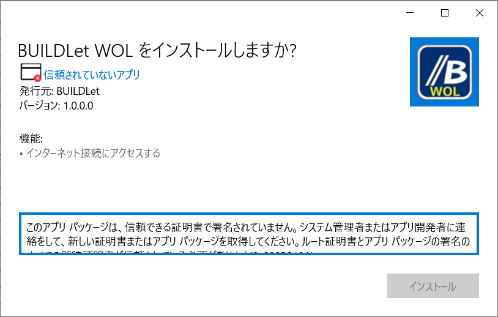

BUILDLet WOL
============

Introduction
------------

This project provides AMD Magic Packet Format Transmitter App on UWP (Universal Windows Platform).

- Send Page  

  

- Setting Page

  

Getting Started
---------------

1. Download the certification file [BUILDLet.cer](./Certificate/BUILDLet.cer) to your computer.
2. Import the downloaded certification file (BUILDLet.cer) into *Trusted Root Certification Authorities* of *Local Machine*, if you can trust us.
3. Download the installer package for your platform ([x86](./BUILDLet.WOL/AppPackages/BUILDLet.WOL_1.2.1.0_x86_Test/BUILDLet.WOL_1.2.1.0_x86.msix), [x64](./BUILDLet.WOL/AppPackages/BUILDLet.WOL_1.2.1.0_x64_Test/BUILDLet.WOL_1.2.1.0_x64.msix), [ARM](./BUILDLet.WOL/AppPackages/BUILDLet.WOL_1.2.1.0_ARM_Test/BUILDLet.WOL_1.2.1.0_ARM.msix) or [ARM64](./BUILDLet.WOL/AppPackages/BUILDLet.WOL_1.2.1.0_ARM64_Test/BUILDLet.WOL_1.2.1.0_ARM64.msix)) on your computer, and execute it.

Trouble Shooting
----------------

- If you have not correctly imported our certification file ([BUILDLet.cer](./Certificate/BUILDLet.cer)) into *Trusted Root Certification Authorities* of *Local Machine*, _**Install**_ button is not enabled as the following figure.

  

  If you can successfully import our certification file ([BUILDLet.cer](Certificate/BUILDLet.cer)), _**Install**_ button gets enabled as the following figure.

  

Build and Test
--------------

- This project (Visual Studio Solution) is built and tested on Visual Studio.
- We did not tested our App on *ARM* Platform (including *ARM64*).

Change History
--------------

- **v1.0.0** (July 8th, 2021)
  - 1st Release

- **v1.1.0** (August 13rd, 2021)
  - History function was added.

- **v1.2.0** (August 14th, 2021)
  - Number of history of MAC address was getting be configurable.

- **v1.2.1** (August 15th, 2021)
  - Enter key for MAC Address was getting not be acceptable.
    (EventTriggerBehavior for SuggestionBox of MacAddress was removed.)

  - The following defects were fixed.
    - Error message is shown when one of candidates is chosen from history.

License
-------

This project is licensed under the [MIT](https://opensource.org/licenses/MIT) License.
